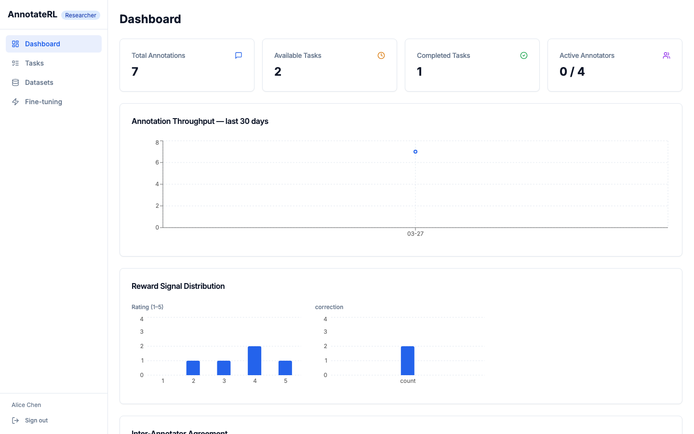
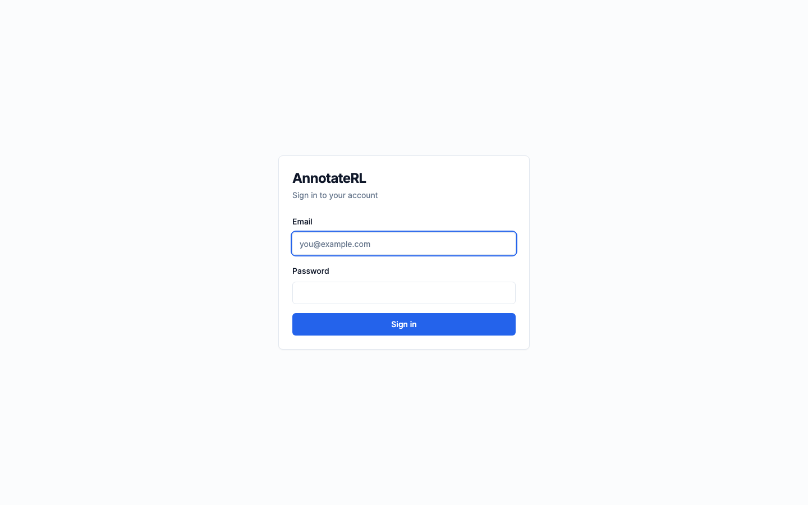
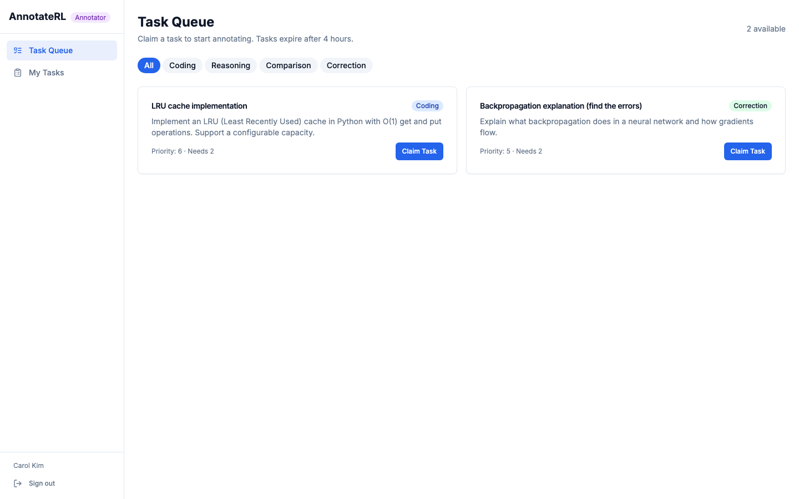
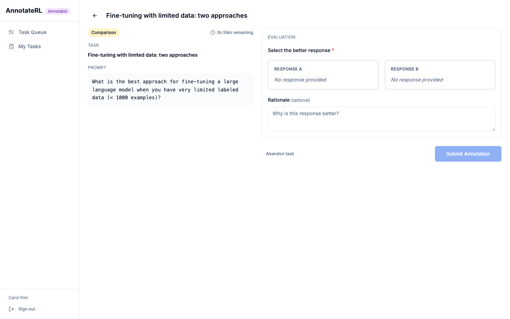
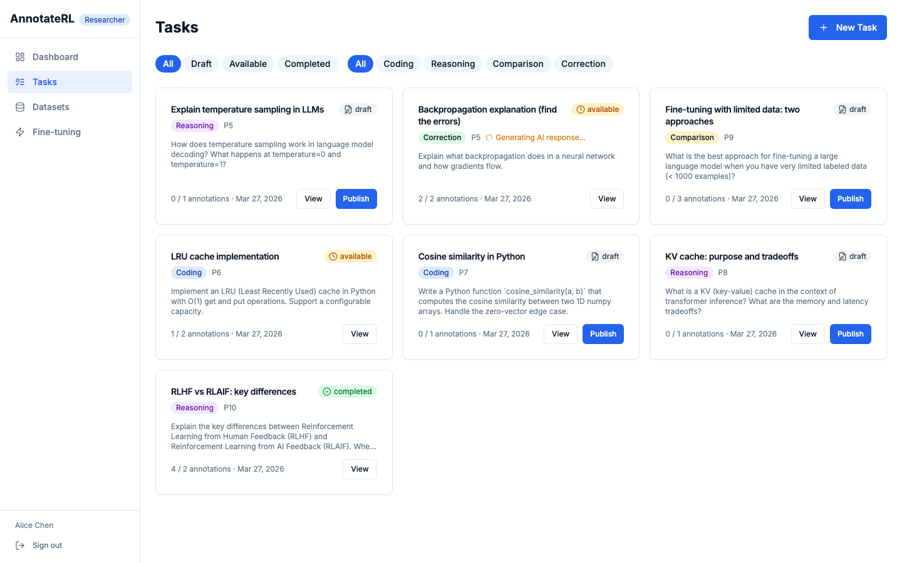
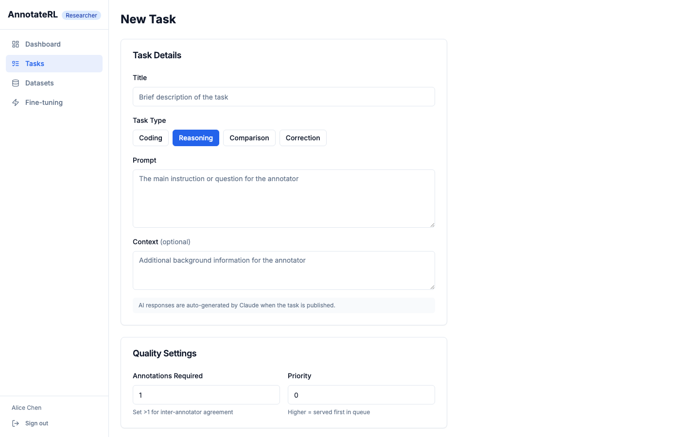
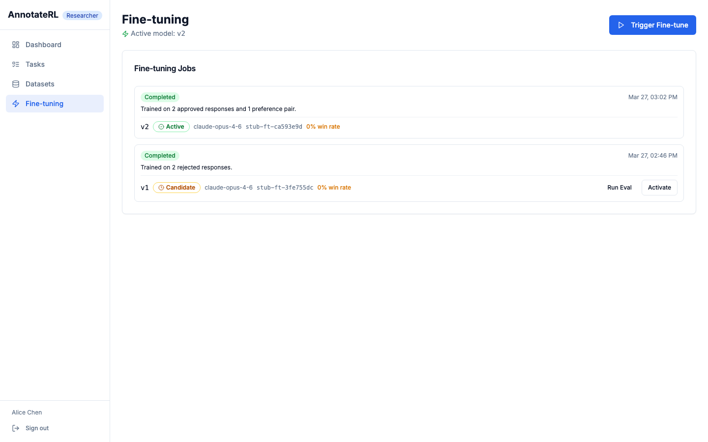
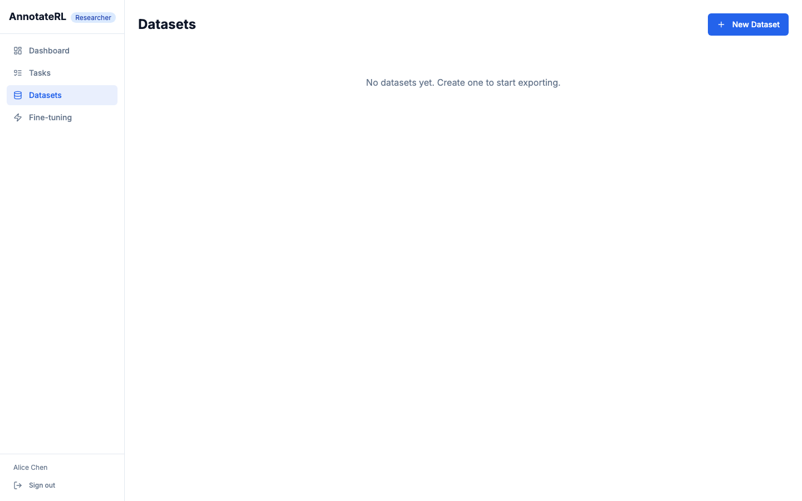

# AnnotateRL

<div align="center">


**A closed-loop RLHF/RLAIF data collection platform.**  
Researchers create tasks → annotators provide feedback → the model automatically improves.



</div>

---

## What is AnnotateRL?

AnnotateRL is a full-stack RLHF (Reinforcement Learning from Human Feedback) data collection platform designed to mirror real-world annotation pipelines used to align large language models.

**Researchers** define tasks — prompts that need human or AI feedback — and publish them to a priority queue. **Annotators** claim tasks from the queue and submit structured reward signals (ratings, comparisons, corrections, or binary judgments). Once a task collects enough annotations, the platform automatically triggers a fine-tuning run against the accumulated signal — no manual export or training step required.

The platform handles the full closed loop: **task creation → AI response generation → human annotation → data export → fine-tuning → new model version** — with every step observable through the researcher dashboard.

---

## Features

- **Four signal types** — rating (1–5), binary (accept/reject), A/B comparison, and free-form correction, each producing normalized reward values for training
- **AI response generation** — on task publish, OpenRouter (free models) auto-populates model responses so annotators always have something to react to
- **Closed-loop fine-tuning** — annotation completions automatically trigger training jobs; new `ModelVersion` records track lineage and can be activated with one click
- **Eval system** — run LLM-as-judge evaluations against candidate model versions before activating them; win-rate tracked per version
- **AI annotator** — synthetic annotation generation for scalable RLAIF data collection alongside human feedback
- **Dataset export** — filter annotations by task type, date range, annotator, or minimum rating and export as HuggingFace-compatible JSONL to S3/MinIO
- **Researcher analytics** — throughput charts, reward distribution histograms, per-annotator calibration metrics, and inter-annotator agreement rates
- **Redis-backed task queue** — `ZADD`/`SKIP LOCKED` prevents double-claiming under concurrent annotator load; assignments auto-expire after 4 hours

---

## Architecture

```
Researcher                Backend                          Infra
──────────                ───────                          ─────
POST /tasks
POST /tasks/{id}/publish
  │──► task.status = available
  │──► Redis ZADD (priority queue)
  └──► BackgroundTask: ai_agent ──────────────────────► OpenRouter API
                                                         (free LLMs)
Annotator
──────────
GET  /queue          (reads DB, not Redis directly)
POST /queue/{id}/claim
  └──► SELECT FOR UPDATE SKIP LOCKED ──────────────────► PostgreSQL
POST /annotations
  │──► Annotation + RewardSignal written
  │──► assignment.status = completed
  └──► if completions >= required:
         task.status = completed
         BackgroundTask: maybe_trigger_finetune
           │──► build training JSONL
           │──► upload to S3 ───────────────────────────► MinIO
           └──► create ModelVersion (is_active=True)
```

**Stack:**

| Layer | Technology |
|---|---|
| API | FastAPI + asyncpg + SQLAlchemy 2.0 |
| Queue | Redis sorted set + `SELECT FOR UPDATE SKIP LOCKED` |
| Storage | PostgreSQL 16 + MinIO (S3-compatible) |
| Frontend | Next.js 14 App Router + TanStack Query + Zustand |
| Auth | JWT (HS256, 15 min) + refresh tokens (SHA-256 hashed) |
| AI | OpenRouter (free models) with fallback chain |

---

## Screenshots

<table>
  <tr>
    <td align="center">
      
      <br/><sub><b>Login</b></sub>
    </td>
    <td align="center">
      
      <br/><sub><b>Annotator Queue</b></sub>
    </td>
  </tr>
  <tr>
    <td align="center">
      
      <br/><sub><b>Annotation Workspace</b></sub>
    </td>
    <td align="center">
      
      <br/><sub><b>Task Management</b></sub>
    </td>
  </tr>
  <tr>
    <td align="center">
      
      <br/><sub><b>Task Detail & Annotations</b></sub>
    </td>
    <td align="center">
      
      <br/><sub><b>Fine-tuning Jobs & Model Versions</b></sub>
    </td>
  </tr>
  <tr>
    <td align="center">
      
      <br/><sub><b>Dataset Export (JSONL → S3)</b></sub>
    </td>
    <td align="center">
      
      <br/><sub><b>Researcher Dashboard & Metrics</b></sub>
    </td>
  </tr>
</table>

---

## Quick Start

### Prerequisites

- [Docker Desktop](https://www.docker.com/products/docker-desktop/) (includes Docker Compose)
- Git

### 1. Clone & configure

```bash
git clone https://github.com/Aayushi-Shah/AnnotateRL.git
cd AnnotateRL
cp .env.example .env
```

Open `.env` and set a `SECRET_KEY` (any long random string). Everything else works out of the box for local development. Optionally add an `OPENROUTER_API_KEY` to enable AI response auto-generation.

### 2. Start with Docker

```bash
docker compose up
```

This starts all six services: PostgreSQL, Redis, MinIO, the bucket initializer, the FastAPI backend, and the Next.js frontend.

### 3. Seed demo data

In a separate terminal:

```bash
docker compose exec backend python seed.py
```

This creates 5 demo users and 7 tasks ready to publish.

### 4. Open the app

| Service | URL |
|---|---|
| Frontend | http://localhost:3000 |
| API docs (Swagger) | http://localhost:8000/docs |
| MinIO console | http://localhost:9001 (minioadmin / minioadmin) |

---

## Demo Accounts

| Email | Password | Role | Access |
|---|---|---|---|
| alice@annotaterl.dev | researcher123 | Researcher | Create tasks, view metrics, export datasets, manage fine-tuning |
| bob@annotaterl.dev | researcher123 | Researcher | Same as Alice |
| carol@annotaterl.dev | annotator123 | Annotator | Claim tasks, submit annotations |
| dave@annotaterl.dev | annotator123 | Annotator | Same as Carol |
| eve@annotaterl.dev | annotator123 | Annotator | Same as Carol |

---

## Task Types & Reward Signals

| Type | Description | Signal | Reward Value |
|---|---|---|---|
| `reasoning` | Open-ended question — annotator rates the model's answer | Rating (1–5) | Normalized float |
| `coding` | Code generation task — annotator rates correctness & style | Rating (1–5) | Normalized float |
| `comparison` | Two model responses shown side-by-side — annotator picks better one | A/B Comparison | 1.0 if A, 0.0 if B |
| `correction` | Model response contains a deliberate flaw — annotator edits it | Free-form correction | No scalar (text delta) |
| `binary` | Simple accept/reject judgment with optional justification | Binary | 1.0 / 0.0 |

---

## API Reference

Full auto-generated API docs are at **`/docs`** (Swagger UI) or **`/redoc`** when the backend is running. A static reference is at [`docs/api-routes.md`](docs/api-routes.md).

**Key endpoints:**

| Group | Endpoints |
|---|---|
| Auth | `POST /auth/login` · `POST /auth/register` · `POST /auth/refresh` |
| Tasks | `GET/POST /tasks` · `PATCH /tasks/{id}` · `POST /tasks/{id}/publish` |
| Queue | `GET /queue` · `POST /queue/{id}/claim` · `GET /queue/mine` |
| Annotations | `POST /annotations` · `GET /annotations` |
| Datasets | `POST /datasets` · `POST /datasets/{id}/export` |
| Fine-tuning | `GET /finetune/jobs` · `POST /finetune/jobs` · `POST /finetune/models/{id}/activate` |
| Metrics | `GET /metrics/overview` · `/throughput` · `/reward-distribution` · `/annotators-calibration` |

---

## Fine-tuning

By default, `FINETUNE_PROVIDER=stub` simulates training (instant, no GPU required). When `FINETUNE_ENABLED=true` and enough annotations are collected, a `FineTuningJob` is created automatically, training data is uploaded to S3, and a new `ModelVersion` is registered.

To plug in a real provider, implement the `TrainingProvider` protocol in `backend/app/services/finetune.py`:

```python
class TrainingProvider(Protocol):
    async def start_training(self, s3_key: str, base_model: str) -> str:
        """Return a provider-assigned model ID."""
        ...
```

Model versions are tracked with `is_active` flags. Use the Fine-tuning page (or `POST /finetune/models/{id}/activate`) to promote a candidate version. Activation automatically re-generates AI responses for all previously rejected tasks using the new model.

---

## Project Structure

```
AnnotateRL/
├── backend/
│   ├── app/
│   │   ├── api/v1/          # FastAPI routers (annotations, tasks, queue, finetune, metrics…)
│   │   ├── core/            # Config, DB session, Redis, auth, S3, dependency injection
│   │   ├── models/          # SQLAlchemy ORM models
│   │   ├── schemas/         # Pydantic request/response schemas
│   │   └── services/        # Business logic (queue, export, ai_agent, finetune, eval)
│   ├── alembic/versions/    # Database migrations
│   └── seed.py              # Demo data seeder
├── frontend/
│   └── src/
│       ├── app/
│       │   ├── researcher/  # Dashboard, tasks, datasets, fine-tuning pages
│       │   └── annotator/   # Queue, my-tasks, workspace pages
│       ├── components/      # Annotation signal UIs, charts, task forms
│       └── lib/             # API client, auth store, TypeScript types
├── docs/                    # Auto-generated reference docs (CI)
│   └── screenshots/         # README screenshots
├── scripts/                 # Utility scripts
└── docker-compose.yml
```

---

## Environment Variables

See [`docs/env-vars.md`](docs/env-vars.md) for the full reference. Key variables:

| Variable | Default | Description |
|---|---|---|
| `SECRET_KEY` | — | JWT signing key (required) |
| `OPENROUTER_API_KEY` | — | Enables AI response auto-generation (optional) |
| `FINETUNE_ENABLED` | `true` | Auto-trigger fine-tuning on task completion |
| `FINETUNE_PROVIDER` | `stub` | `stub` (simulated) or a real provider |
| `FINETUNE_MIN_ROWS` | `1` | Minimum annotations before a fine-tuning job runs |
| `S3_BUCKET` | `annotaterl-exports` | Bucket for dataset exports and training data |

---

## Development (without Docker)

```bash
# Backend
cd backend
python -m venv .venv && source .venv/bin/activate
pip install -r requirements.txt
alembic upgrade head
python seed.py
uvicorn app.main:app --reload   # :8000

# Frontend (requires Node.js >= 18)
cd frontend
npm install
npm run dev                     # :3000
```

Run validation before committing:

```bash
# Backend — syntax check
python -m py_compile $(find app -name "*.py")

# Frontend — lint + type check
npm run lint
npm run build
```

---

## Data Model

```
User (researcher | annotator)
  └── Task (draft → available → completed)
        └── TaskAssignment (in_progress → completed | expired | abandoned)
              └── Annotation
                    └── RewardSignal (rating | comparison | correction | binary)

Dataset (filter_config) → DatasetExport (JSONL → S3)
FineTuningJob → ModelVersion (is_active flag)
EvalSet → EvalResult (win_rate per ModelVersion)
```

---

## License

MIT
